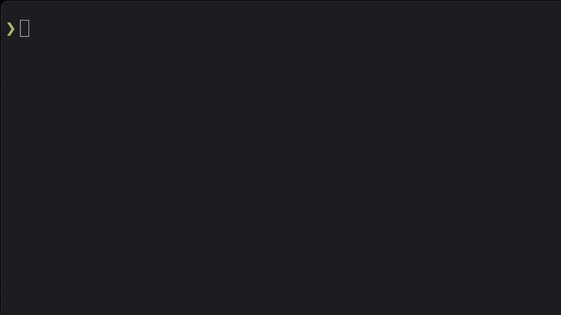

# Detector for Docker Socket (DDS)

A `kubectl` plugin to detect if active Kubernetes workloads are mounting the docker socket (`dock.sock`) volume.



## Install

Install the plugin with

```
krew install dds
```

## How it works

`dds` looks for every pod in your Kubernetes cluster.
If pods are part of a workload (eg Deployment, StatefulSet) it inspects the workload type instead of pods directly.

It then inspects all of the volumes in the containers and looks for any volume with the path `*docker.sock`

Supported workload types:

* Pods
* Deployments
* StatefulSets
* DaemonSets
* Jobs
* CronJobs

## Run

You can run the plugin with no arguments and it will inspect all pods in all namespaces that the current Kubernetes user has access to.

```bash
kubectl dds
```
example output
```
NAMESPACE       TYPE            NAME                    STATUS
default         deployment      deploy-docker-volume    mounted
default         daemonset       ds-docker-volume        mounted
default         statefulset     ss-docker-volume        mounted
default         job             job-docker-volume       mounted
default         cron            cron-docker-volume      mounted
kube-system     pod             pod-docker-volume       mounted
test1           deployment      deploy-docker-volume    mounted
```

You can specify a namespace to limit the scope of what will be scanned.

```
kubectl dds --namespace kube-system
```
example output
```
NAMESPACE       TYPE    NAME                    STATUS
kube-system     pod     pod-docker-volume       mounted
```

You can run `dds` against a single manifest file or folder of manifest files (recursive).
The repo includes a test/manifests directory.

```
kubectl dds --filename test
```
example output
```
FILE                                                    LINE    STATUS
test/manifests/docker-volume.cronjob.yaml               22      mounted
test/manifests/docker-volume.daemonset.yaml             24      mounted
test/manifests/docker-volume.deploy.test1.yaml          32      mounted
test/manifests/docker-volume.deploy.yaml                25      mounted
test/manifests/docker-volume.job.yaml                   17      mounted
test/manifests/docker-volume.pod.kube-system.yaml       14      mounted
test/manifests/docker-volume.statefulset.yaml           26      mounted
```

Use the `--verbose` flag to see all scanned workloads/files
```
kubectl dds --verbose
```
example output
```
NAMESPACE       TYPE            NAME                    STATUS
default         deployment      deploy-docker-volume    mounted
default         daemonset       ds-docker-volume        mounted
default         statefulset     ss-docker-volume        mounted
default         job             job-docker-volume       mounted
default         cron            cron-docker-volume      mounted
kube-system     pod             pod-docker-volume       mounted
kube-system     daemonset       aws-node                not-mounted
kube-system     daemonset       ebs-csi-node            not-mounted
kube-system     daemonset       kube-proxy              not-mounted
test1           deployment      deploy-docker-volume    mounted
```

You can use `dds` as part of your CI pipeline to catch manifest files before they are deployed.
```
kubectl dds --exit-with-error -f YOUR_FILES
```
If the docker.sock volume is found in any files the cli exit code with be 1.

## Build

To build the binary you can use `make dsd` or `go build -o kubectl-dds main.go`

Install the `kubectl-dds` binary somewhere in your path to use it with `kubectl` or use it by itself without kubectl.
The same kubectl authentication works with or without `kubectl` (e.g. $HOME/.kube/config or KUBECONFIG).

## Testing

There are different test workloads in the `/tests` folder.
You can deploy these workloads to verify the plugin is working as intended.

```
kubectl apply -f tests/
daemonset.apps/ds-docker-volume created
namespace/test1 created
deployment.apps/deploy-docker-volume created
deployment.apps/deploy-docker-volume created
job.batch/job-docker-volume created
pod/pod-docker-volume created
statefulset.apps/ss-docker-volume created
pod/empty-volume created
deployment.apps/no-volume created
```

and then run

```
kubectl dds
NAMESPACE       TYPE            NAME                    STATUS
default         deployment      deploy-docker-volume    mounted
default         daemonset       ds-docker-volume        mounted
default         statefulset     ss-docker-volume        mounted
default         job             job-docker-volume       mounted
default         cron            cron-docker-volume      mounted
kube-system     pod             pod-docker-volume       mounted
test1           deployment      deploy-docker-volume    mounted
```
